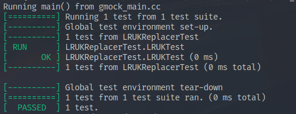
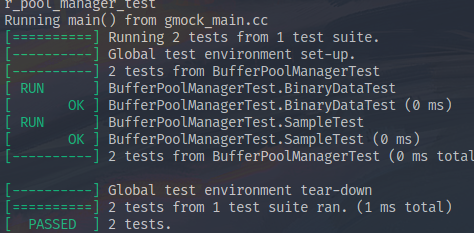
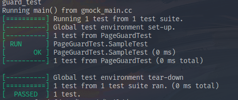

# CMU15445-pro1记录

## CMU15445-pro1记录

离上一次这个 Lab 的更新已经有三周了，主要是中间系统滚挂一次切成之前的镜像也没用，无奈之下重装系统，借此机会也正式将 i3wm 引入我的工作流。除此之外这三周也还有不少事情要先解决。多方耽搁之下这个 Lab 的第二个 Project 拖到现在才做完。

### Project 1 - Buffer Pool Manager

这个 Project 是对之前课上提出的 Buffer Pool 概念的一个实现，是每年都有的保留项目。我看了下前几年的要求，不同的是将第一部分哈希表实现的内容去除，而多了一个通过读写锁实现并发的 Buffer Pool，这也与前面一个 Project 中最后的一部分内容相合。

#### 1：Task #1 LRU-K Replacement Policy

第一个阶段便是实现一个改进的 LRU  ( Least Recent Used ) 算法。即 LRU-K 算法。我在网上搜索到的课程资料中找到了 LRU 算法的 Leetcode 相关题目。浅做一遍后再看一遍它给的算法说明，果然清晰不少。

LRU-K 算法驱逐一个帧，其后向 k 距离是替换器中所有帧的最大值。向后 k 距离计算为当前时间戳与往前第 k 次访问的时间戳之间的时间差。历史访问次数少于 k 的帧被赋予 +inf 作为其向后 k 距离。当多个帧具有 +inf 向后 k 距离时，替换器驱逐具有最早总体时间戳的帧（即，其最近记录的访问是所有帧中总体上最近最少访问的帧）。

我们当然不会直接使用+inf这样简单粗暴的方式。可以看到，其实该算法要处理的帧分为两部分。

第一个部分是没达到 k 次访问的帧，处理这些帧时，我们采用先进先出的方法。即最早访问的帧最先被驱逐。所以可以使用一个队列，或者直接使用 STL 容器中的 List 即一个双向链表来存储。驱逐时只要这一部分不是空的就先驱逐这一部分的第一个就好。

而第二个部分，即已经达到k次访问的帧，我们可以预先使用一个先进先出的队列来存储其历史时间戳，一旦有新的访问记录进来，就删掉队列前端的记录，然后将新记录存到后端上，这样就可以保证队列前端第一个记录恰好就是往前第 k 次的历史记录。然后在每一次将要从这一部分的帧中驱逐的时候先依照前端第一个记录的大小进行整理后再驱逐第一个帧就好。

还有一个部分是这一部分要求要保证一部分帧不能被驱逐。而且可以从可驱逐和不可驱逐间转换。那么对于不可驱逐的帧我们只需要让它们待在存储所有帧的 map 中就可以了。转换就是把他们拿出来再分类装入这两个集合中，注意装的时候要再整理一遍。

顺利通过测试～

#### 2：Task #2 - Buffer Pool Manager

这里的 Buffer Pool Manager 主要就是对之前的 LRU-K 策略实现后的具体应用。

这里要理清一下几个成员之间的关系，下面引用了博客[https://blog.eleven.wiki/posts/cmu15-445-project1-buffer-pool-manager/](https://blog.eleven.wiki/posts/cmu15-445-project1-buffer-pool-manager/)

* pages：buffer pool 中缓存 pages 的指针数组
* disk_manager：框架提供，可以用来读取 disk 上指定 page id 的 page 数据，或者向 disk 上给定 page id 对应的 page 里写入数据
* page_table：刚才实现的 Extendible Hash Table，用来将 page id 映射到 frame id，即 page 在 buffer pool 中的位置
* replacer：刚才实现的 LRU-K Replacer，在需要驱逐 page 腾出空间时，告诉我们应该驱逐哪个 page
* free_list：空闲的 frame 列表

而我们要实现的方法中，`NewPage` 和 `FetchPage` 两个方法最为重要。在这里简单顺一下这两个方法的思路就可以理清这个 Task 的脉络。

对于 `NewPage` 方法：

1. 首先对 free_list_和 replacer_判空，若空则说明没有可用的frame，直接返回 `nullptr`即可。
2. 如果 free_list_空，就从 replacer_中更新一个可用的 frame，具体步骤是：
   1. 从 replacer_中驱逐出一个可驱逐的帧，读出里面装载的 page 。
   2. 如果 page 是写过的页面，就把它先保存进硬盘中。
   3. 将 page 从 BufferPool 和 frame 中去除，将空的 frame 加入 free_list_。
3. 从 free_list_中取出一个可用的 frame 并分配 page_id。
4. 将 frame 中的数据清零。
5. 更新 replacer_和 page_table_。

对于 `FetchPage` 方法，先要从 BufferPool 现有的 Page 中寻找。如果找不到就用类似于 NewPage 的方法将 Page 创建出来。

剩余的方法其实照着注释写就好。

值得注意的是为了线程安全，这里的类中提供了互斥锁。但其实用自旋锁会更好。我在这里为了省事是在方法进入和返回时加锁，粒度很大，效率比较低。优化的话可以缩小粒度或改成自旋锁的形式。

#### 3：Task #3 Read/Write Page Guards

这里的 Task 换成了读写页面的保护，通过在外包装 Guard 类的形式确定读写形式并提供自动销毁程序员遗漏的未释放页面。这里的代码逻辑不算复杂，主要是要建立起这样一种应对多线程安全和效率的概念。

### 总结

比 6.824 简单多了，也就第一个算法理解上做了下题花了一点时间，主要是对课上内容的理解和归纳。

